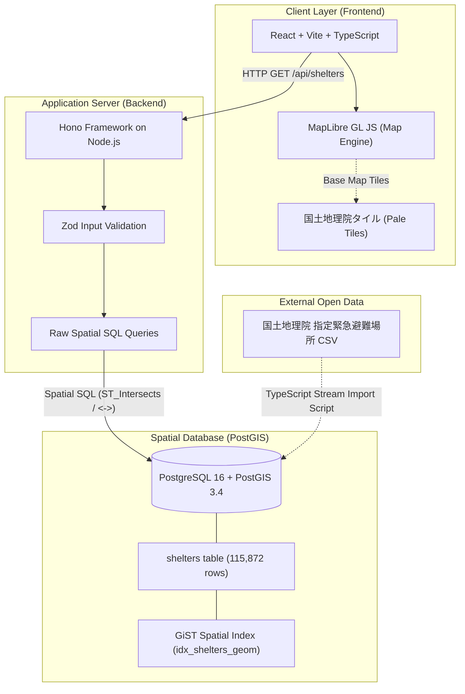

# Hinan Map (避難所マップ) 🗺️

> **Multilingual Evacuation-Site Finder (WebGIS) for Foreign Residents in Japan**  
> 在日外国人・観光客向け 多言語対応 指定緊急避難場所検索 WebGIS アプリケーション

---

## 📖 English Overview

**Hinan Map** is a high-performance WebGIS application designed to help foreign residents and visitors in Japan locate the nearest designated emergency evacuation sites (*指定緊急避難場所*) during natural disasters such as earthquakes, floods, and tsunamis.

Built on **PostGIS** with over **115,872 nationwide shelter locations** directly ingested from the Geospatial Information Authority of Japan (**国土地理院**), Hinan Map provides real-time bounding box viewport loading, k-Nearest Neighbor (k-NN) spatial distance sorting, hazard filtering, and bilingual (Japanese / English) UI localization.

### Key Features
* 🗺️ **Interactive Vector Map**: Powered by MapLibre GL JS and GSI Pale Tiles (`地理院タイル 淡色地図`).
* 📍 **k-NN Nearest Shelter Finder**: Instant 1-click or current location search returning the 5 nearest shelters with accurate geodetic distances in meters.
* 🛡️ **8 Hazard Type Filtering**: Filter by Earthquake, Flood, Tsunami, Landslide, Fire, Inland Flood, Storm Surge, and Volcanic activity.
* ⚡ **High-Performance Spatial SQL**: Bounding box queries (`ST_Intersects`) and index-accelerated k-NN spatial operators (`<->`) returning results in **< 20ms**.
* 🌐 **Bilingual Support (i18n)**: Instant switching between **日本語** and **English** (with shelter names preserved in Japanese for local signage matching).

---

## 🇯🇵 日本語概要

**Hinan Map** は、地震・洪水・津波などの自然災害発生時に、在日外国人や訪日観光客が最寄りの「指定緊急避難場所」を迅速に検索できる高機能 WebGIS アプリケーションです。

国土地理院が提供する全国 **115,872 件**の避難場所データを **PostGIS** 空間データベースにインポートし、マップ表示領域に応じた動的バウンディングボックス取得や、k近傍法（k-NN）によるリアルタイム最短距離計算を実現しています。

---

## 📐 Architecture Diagram (システム構成図)



---

## 💡 3 Key Technical Design Decisions (3つの技術的決定)

### 1. Why PostGIS over Client-side / Plain DB Filtering? (なぜ PostGIS なのか)
* **Problem**: Ingesting and querying 115,872 spatial points directly in client-side memory slows down browsers and causes network bottlenecks.
* **Solution**: PostGIS stores coordinates using spatial data types and optimizes 2D spatial queries using **GiST (Generalized Search Tree) R-Tree indexing**. This allows spatial filtering (`ST_Intersects`) and k-NN nearest search (`<->`) to run on the server in **under 20ms**.

### 2. Why Viewport Bounding Box (BBOX) Loading? (なぜ BBOX 読み込みなのか)
* **Problem**: Transferring all nationwide points at once creates a multi-megabyte JSON payload that degrades mobile network performance.
* **Solution**: As the user pans or zooms, `moveend` triggers `GET /api/shelters?bbox=minLng,minLat,maxLng,maxLat`. The server uses `ST_MakeEnvelope` to return only features within the active view, keeping response payloads light (~10-50 KB).

### 3. Why `GEOGRAPHY(Point, 4326)` over `GEOMETRY`? (なぜ GEOGRAPHY 型なのか)
* **Problem**: Flat Cartesian geometry (`GEOMETRY`) measures distance in angular degrees ($^\circ$), which distorts distance calculations across different latitudes in Japan.
* **Solution**: `GEOGRAPHY(Point, 4326)` models coordinates on the **WGS 84 ellipsoid**. PostGIS functions like `ST_Distance` calculate true geodetic distances in real-world **meters**, providing precise distance feedback to citizens evacuating on foot.

---

## 🛠️ Technology Stack (技術スタック)

| Layer | Technology |
|---|---|
| **Database** | PostgreSQL 16 + PostGIS 3.4 (Docker container `postgis/postgis`) |
| **Backend API** | Hono + Node.js + TypeScript, Zod validation, `pg` Pool (Raw Spatial SQL) |
| **Frontend** | React 18 + Vite + TypeScript + MapLibre GL JS |
| **Base Map** | 国土地理院タイル 淡色地図 (`https://cyberjapandata.gsi.go.jp/xyz/pale/...`) |
| **Testing & CI** | Vitest API tests, GitHub Actions CI with PostGIS service container |
| **Containerization**| Multi-stage Docker Compose (`db`, `api`, `web` Nginx reverse proxy) |

---

## 🚀 Quick Start (ローカル起動手順)

### Prerequisites
* Docker & Docker Compose
* Node.js (v20 or v22)

### 1. Clone & Start PostGIS Container
```bash
git clone https://github.com/your-username/hinan-map.git
cd hinan-map
docker compose up -d db
```

### 2. Import Nationwide Shelter Dataset (115,872 records)
```bash
npm install
npm run db:import
```

### 3. Run Backend API & Web Frontend
In separate terminal windows:
```bash
# Terminal 1: Backend Hono API (Port 3000)
npm run dev:api

# Terminal 2: Web Frontend (Port 5173 / 5174)
npm run dev:web
```

---

## 🧪 Testing & Verification

Run the Vitest integration test suite against PostGIS:
```bash
npm run test
```

Run TypeScript typechecks and production build:
```bash
npm run typecheck
```

---

## 🎓 What I Learned (得られた知見・学び)

* **Spatial Database Optimization**: Mastered GiST index creation and PostGIS k-NN distance sorting operators (`<->`) versus naive distance calculation.
* **Large Dataset Streaming**: Implemented streaming CSV parsing for 115k+ UTF-8 BOM records with batch parameterized UPSERT queries (`UNNEST`).
* **WebGIS UI Patterns**: Designed interactive vector map clustering, straight-line distance connection vectors, and viewport-bound state management in React.
* **CI Integration Testing**: Configured GitHub Actions workflows utilizing live PostGIS service containers for automated test verification.

---

## 📜 Data Attribution & Credit (出典表記)

* **災害避難場所データ**: 出典：[国土地理院 指定緊急避難場所データ](https://www.gsi.go.jp/bousaichiri/hinanbasho.html)
* **ベースマップタイル**: 出典：[国土地理院タイル（淡色地図）](https://maps.gsi.go.jp/development/ichiran.html)
